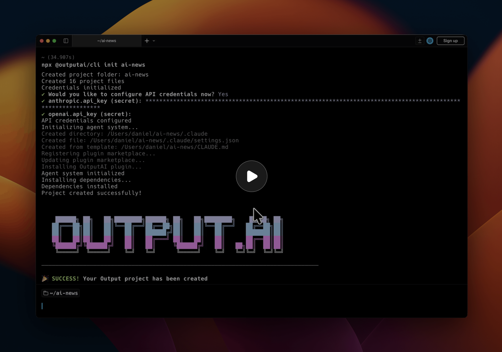
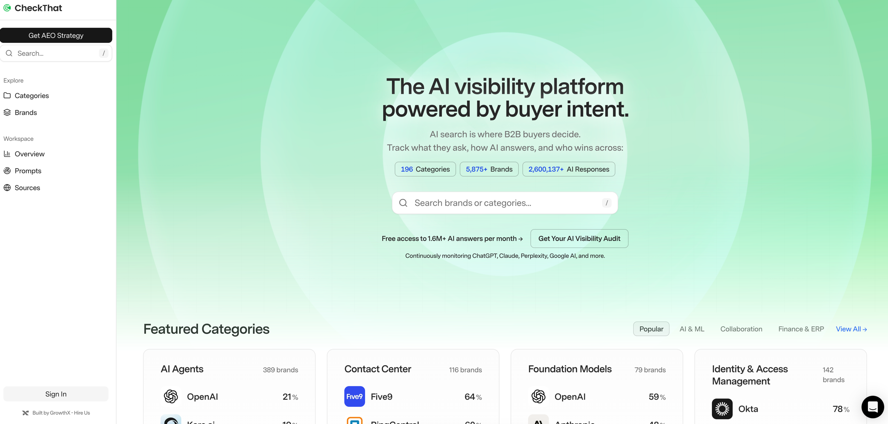

# Output

[](https://github.com/growthxai/output/stargazers)
[](https://www.npmjs.com/package/@outputai/core)
[](LICENSE)
[](https://www.typescriptlang.org/)
[](https://github.com/growthxai/output/actions/workflows/validation.yml)

The open-source TypeScript framework for building AI workflows and agents. Designed for Claude Code — describe what you want, Claude builds it, with all the best practices already in place.

One framework. Prompts, evals, tracing, cost tracking, orchestration, credentials. No SaaS fragmentation. No vendor lock-in. Everything in your codebase, everything your AI coding agent can reach.

<p align="center">
  <a href="https://output.ai/?autoplay=true"></a>
  <br/>
  <em>▶ <a href="https://output.ai/?autoplay=true">Watch a complete example of using Output to build a newsletter pipeline</a></em>
</p>

## Why Output

Every piece of the AI stack is becoming a separate subscription. Prompts in one tool. Traces in another. Evals in a third. Cost tracking across five dashboards. None of them talk to each other. Half of them will get acquired or shut down before your product ships.

Output brings everything together. One TypeScript framework, extracted from thousands of production AI workflows. Best practices baked in so beginners ship professional code from day one, and experienced AI engineers stop rebuilding the same infrastructure.

### Build AI using AI

Output is the first framework designed for AI coding agents. The entire codebase is structured so Claude Code can scaffold, plan, generate, test, and iterate on your workflows. Every workflow is a folder — code, prompts, tests, evals, traces, all together. Your agent reads one folder and has full context.

### Own your prompts

`.prompt` files with YAML frontmatter and Liquid templating. Version-controlled, reviewable in PRs, deployed with your code. Switch providers by changing one line. No subscription needed to manage your own prompts.

### See everything that happens

Every LLM call, HTTP request, and step traced automatically. Token counts, costs, latency, full prompt/response pairs. JSON in `logs/runs/`. Zero config. Claude Code analyzes your traces and fixes issues — because the data is in your file system.

### Test AI like software

LLM-as-judge evaluators with confidence scores. Inline evaluators for production retry loops. Offline evaluators for dataset testing. Deterministic assertions and subjective quality judges.

### Use any model

Anthropic, OpenAI, Azure, Vertex AI, Bedrock. One API. Structured outputs, streaming, tool calling — all work the same regardless of provider.

### Scale without worrying

Temporal under the hood. Automatic retries with exponential backoff. Workflow history. Replay on failure. Child workflows. Parallel execution with concurrency control. You don't think about Temporal until you need it — then it's already there.

### Keep secrets secret

AI apps need a lot of API keys. Sharing `.env` files is risky, and coding agents shouldn't see your secrets. Output encrypts credentials with AES-256-GCM, scoped per environment and workflow, managed through the CLI. No external vault subscription needed.

## Quick Start

Requirements:

- [Node.js](https://nodejs.org/) 20+
- [Docker Desktop](https://www.docker.com/products/docker-desktop/)
- An LLM API key (e.g. [Anthropic](https://console.anthropic.com/))

Scaffold a project and add your API key to `.env` (`ANTHROPIC_API_KEY=sk-ant-...`):

```bash
npx @outputai/cli init
cd <project-name>
```

Start the full development environment — Temporal server, API server, a worker with hot reload, and the Temporal UI at http://localhost:8080:

```bash
npx output dev
```

Run your first workflow and inspect the execution:

```bash
npx output workflow run blog_evaluator paulgraham_hwh
```

```bash
npx output workflow debug <workflow-id>
```

For the full getting started guide, see the [documentation](docs/guides/start-here/getting-started.mdx).

## Core Concepts

### Workflows

Orchestration layer — deterministic coordination logic, no I/O.

```javascript
// src/workflows/research/workflow.ts
workflow({
  name: 'research',
  fn: async (input) => {
    const data = await gatherSources(input);
    const analysis = await analyzeContent(data);
    const quality = await checkQuality(analysis);
    return quality.passed ? analysis : await reviseContent(analysis, quality);
  }
});
```

### Steps

Where I/O happens — API calls, LLM requests, database queries. Each step runs once and its result is cached for replay.

```javascript
// src/workflows/research/steps.ts
step({
  name: 'gatherSources',
  fn: async (input) => {
    const results = await searchApi(input.topic);
    return { sources: results };
  }
});
```

### Prompts

`.prompt` files with YAML configuration and Liquid templating.

```yaml
---
provider: anthropic
model: claude-sonnet-4-20250514
temperature: 0
---

<system>You are a research analyst.</system>
<user>Analyze the following sources about {{ topic }}: {{ sources }}</user>
```

### Evaluators

LLM-as-judge evaluation with confidence scores and reasoning.

```javascript
// src/workflows/research/evaluators.ts
evaluator({
  name: 'checkQuality',
  fn: async (content) => {
    const { output } = await generateText({
      prompt: 'evaluate_quality',
      variables: { content },
      output: Output.object({
        schema: z.object({
          isQuality: z.boolean(),
          confidence: z.number().describe('0-100'),
          reasoning: z.string()
        })
      })
    });

    return new EvaluationBooleanResult({
      value: output.isQuality,
      confidence: output.confidence,
      reasoning: output.reasoning
    });
  }
});
```

## SDK Packages

| Package | Description |
|---------|-------------|
| **[@outputai/core](sdk/core)** | Workflow, step, and evaluator primitives |
| **[@outputai/llm](sdk/llm)** | Multi-provider LLM with prompt management |
| **[@outputai/http](sdk/http)** | HTTP client with tracing |
| **[@outputai/cli](sdk/cli)** | CLI for project init, dev environment, and workflow management |

## Example Workflows

Production-ready workflows you can run locally, learn from, and fork — all from the [output-examples](https://github.com/growthxai/output-examples) gallery:

| Workflow | Description | APIs |
|----------|-------------|------|
| [blog_evaluator](https://github.com/growthxai/output-examples/tree/main/src/workflows/blog_evaluator) | Evaluate blog post signal-to-noise quality | Jina Reader |
| [call_scorer](https://github.com/growthxai/output-examples/tree/main/src/workflows/call_scorer) | Score sales call transcripts against MEDDIC, BANT, or SPIN | LLM only |
| [changelog_generator](https://github.com/growthxai/output-examples/tree/main/src/workflows/changelog_generator) | Generate categorized changelogs from GitHub commits and PRs | GitHub |
| [dependency_audit](https://github.com/growthxai/output-examples/tree/main/src/workflows/dependency_audit) | Audit npm dependencies for vulnerabilities, licenses, and abandonment | GitHub, OSV, npm |
| [recipe_extractor](https://github.com/growthxai/output-examples/tree/main/src/workflows/recipe_extractor) | Extract structured recipes from blog URLs | Jina Reader |
| [url_summarizer](https://github.com/growthxai/output-examples/tree/main/src/workflows/url_summarizer) | Summarize any webpage into TLDR, key points, and FAQ | Jina Reader |
| [youtube_summarizer](https://github.com/growthxai/output-examples/tree/main/src/workflows/youtube_summarizer) | Summarize YouTube videos with key moments and takeaways | YouTube |
| [ai_hn_digest](https://github.com/growthxai/output-examples/tree/main/src/workflows/ai_hn_digest) | Personalized Hacker News digest published to Beehiiv newsletter | HN, Jina Reader, Beehiiv |
| [sales_call_processor](https://github.com/growthxai/output-examples/tree/main/src/workflows/sales_call_processor) | Process sales call transcripts into notes + parallel recipe analyses | LLM only |

Browse the full gallery at [output.ai/gallery](https://output.ai/gallery).

## Projects using Output

| Project | Description |
|---|---|
| <a href="https://checkthat.ai"></a> | **[CheckThat](https://checkthat.ai)** is an AEO platform built on **Output**'s durable, deterministic LLM workflows — tracking how B2B brands show up across ChatGPT, Claude, Perplexity, and Google AI, covering 2.6M+ AI responses spanning 5,875+ brands. |

## Configuration

For production configuration and advanced settings (LLM providers, Temporal Cloud, tracing, and more), see the [operations docs](https://docs.output.ai/operations/testing).

## Contributing

See [CONTRIBUTING.md](CONTRIBUTING.md).

## License

Apache 2.0 — see [LICENSE](LICENSE) file.

## Acknowledgments

Built with [Temporal](https://temporal.io), [Vercel AI SDK](https://sdk.vercelai), [Zod](https://zod.dev), [LiquidJS](https://liquidjs.com).
